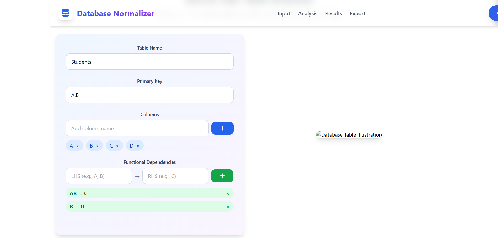
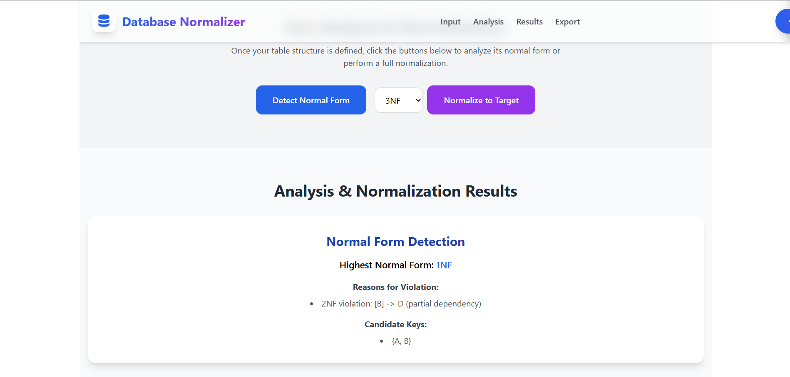
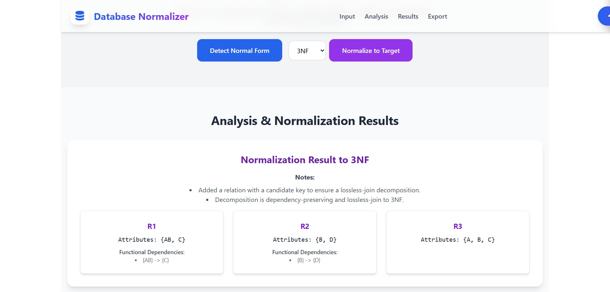

# DBNorm – An Efficient Database Normalizer

DBNorm is a full-stack academic project developed as part of the B.Tech final year curriculum.  
The system focuses on analyzing relational database schemas and transforming them into well-structured normal forms.

---

## 📌 Project Type
B.Tech Final Year Major Project

---

## 📂 Repository Structure

```
DBNorm
├── frontend   # React application
└── backend    # Spring Boot application
```

---

## 🧩 Problem Statement

Database normalization is a critical process in relational database design, but performing it manually is time-consuming and error-prone.  
Students and developers often face difficulties in identifying functional dependencies and determining the correct normal form.  
There is a lack of simple, interactive tools that can automatically analyze schemas and guide users through the normalization process.  
DBNorm addresses this problem by providing an automated and user-friendly database normalization system.

---

## 🎯 Project Objectives

- To analyze relational database schemas provided by the user  
- To identify functional and multivalued dependencies  
- To determine the highest normal form of a given schema  
- To normalize schemas up to 3NF, BCNF, 4NF, and 5NF  
- To provide a simple and interactive web-based interface

---

## 💻 Technology Stack

### Frontend
- React.js
- HTML5
- CSS3
- JavaScript

### Backend
- Spring Boot
- Java
- RESTful APIs
- Hibernate / JPA

---

## 🏗️ System Architecture

DBNorm follows a modular client–server architecture.  
The frontend, developed using React and Vite, allows users to input database schemas and functional dependencies.  
The backend, implemented using Spring Boot, applies normalization algorithms and business logic on the received input.  
The computed normal form and normalized schemas are then returned to the frontend for visualization, without using persistent storage.

---

## ✨ Key Features

- Accepts user-defined relational schemas and functional dependencies  
- Automatically determines the current normal form of a schema  
- Performs normalization up to 3NF, BCNF, 4NF, and 5NF  
- Applies normalization logic dynamically without persistent storage  
- Displays normalized schemas and results in real time  
- Simple and user-friendly web interface

---

## 🚀 How to Run the Project (Local Setup)

### Prerequisites
- Node.js and npm
- Java JDK 8 or above
- Maven

### Steps to Run

Frontend:
- cd frontend
- npm install
- npm start

Backend:
- cd backend
- mvn clean install
- mvn spring-boot:run

---
## 📸 Screenshots

### Schema & Functional Dependency Input


### Detection of Present Normal Form


### Normalized Schema to Target Normal Form


